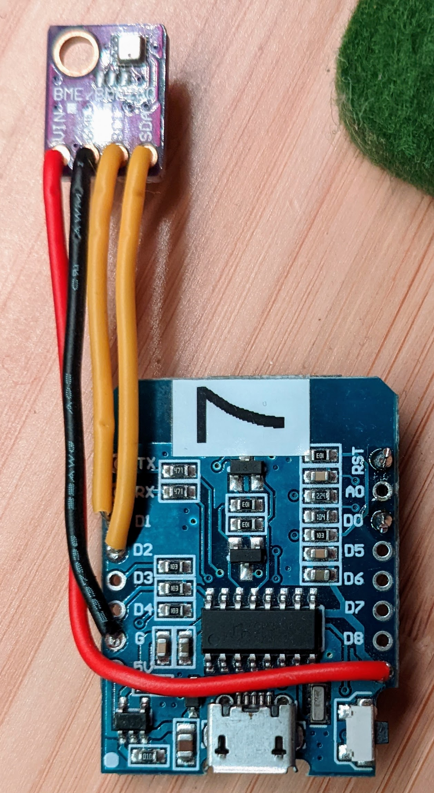
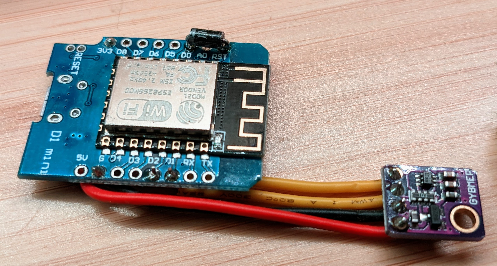

# PlatformIO ESP8266 firmware uploading BME280 ambient conditions to InfluxDB

This is a **PlatformIO** project to use an **ESP8266** to get **temperature, humidity and pressure** measurements from a **BME280 sensor**, connect to WiFi and upload it to an **InfluxDB** database.

 * All configuration is editable through serial, no reflash needed
 * Device enters deep sleep between measurements

Created for a D1 Mini device; should adapt to any other microcontrollers and sensors with fairly minimal edits.  If you do so (or want to do so), let me know and perhaps we can integrate it into this project.

### BME280 auto-heating and deep sleep

When the BME280 is powered on, it warms 2-3C.  Therefore this sketch enters deep sleep between measurements and collects its measurement as early as possible after boot.

The BME280 temperature sensor is (I believe) present primarily to compensate its pressure sensor for the sensor's intended use is as an altimeter, but with deep sleep it provides good measurements.

Also, deep sleep saves a lot of power, and the sensor should work for a good period on battery.

### Configuration over Serial

Configuration is stored on the ESP in EEPROM, edited over Serial.  With Platformio installed it should be as simple as running `pio run -t upload` and then `pio run -t monitor` to connect to serial and edit settings - just reset once running the monitor.  Then you should see this:

```

====================================================================
Settings:
Wifi:
  ssid            = "myWiFi"
  psk             = "MyWiFiPassword"
  hostname        = "Thing7"
Config
  update_period_s = 300
  fahrenheit      = yes
Calibration values
  temp_offset_C   = -0.20 (NOTE: Celcius)
InfluxDB Settings
  url             = "http://my_host.local:8086"
  org             = "Flange" (InfluxDB 1: name)
  token           = "would be here" (InfluxDB 1: leave blank)
  bucket          = "default" (InfluxDB 1: leave blank)
  location        = "desk" (Influx record tag)


    83.292s Enter e.g. "ssid=MyWiFi"
    83.296s  - shortest unique name prefix is accepted, e.g. "ss=MyWiFi"
    83.302s Or enter "!" to quit
    83.305s > 
```

## Connecting Hardware

Just takes a little soldering.  Any ESP8266 with I2C pins should work.  This was created using a D1 Mini clone and typical 4-pin I2C BME280 package (total < US$6), connecting pins:

| D1 Mini | BME280 |
|---------|--------|
| 3.3V    | VIN    |
| G       | GND    |
| D1      | SCL    |
| D2      | SCA    |

Then to allow the device to wake itself up, the RST pin must be connected to D0 (GPIO16).  A small resistor (300-1000Ω) probably works, but best to use a diode, silvered end on the D0/GPIO16 pin.




If you connect RST with just a wire, uploading firmware becomes very difficult (hint, as the upload tool prints dots and dashes, with pauses, click reset /just before/ it resumes from a pause).

If you upload faulty that crashes or sleeps immediately after boot, normal flashing may be impossible.  A full reset flash is possible if you first connect D3 & D8 to GND, D5 to 3.3V.
